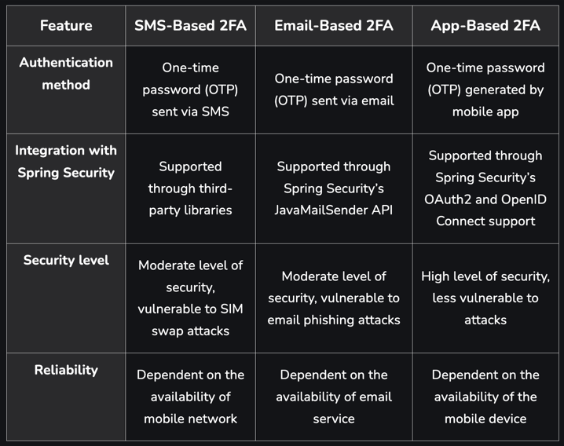

 Demo project to set up two-factor authentication using Spring Security and Vonage Nexmo.

### Theory

Two-factor authentication (2FA) is a security method that requires users to provide two forms of authentication to access
their accounts. These forms of authentication typically include something the user knows (such as a password or PIN) 
and something the user has (such as a mobile device or hardware token). 

2FA is important for securing user accounts because it provides an additional layer of security beyond just a password. 
Passwords are often easy to guess or steal, and many users reuse the same password for multiple accounts. By requiring a
second factor, 2FA can help prevent unauthorized access even if a user’s password is compromised.

By implementing 2FA, organizations can significantly reduce the risk of data breaches and protect sensitive information 
from unauthorized access.

Different Types of 2FA:
* SMS-based authentication: This method sends a one-time password (OTP) to the user’s registered mobile number via SMS. 
The user must enter the OTP to complete the login process. Spring Security integrates with SMS gateways such as Twilio 
and Clickatell to enable SMS-based authentication.
* Email-based authentication: Similar to SMS-based authentication, this method involves sending an OTP to the user’s 
registered email address. Spring Security provides support for email-based authentication using the Spring Mail module.
* Time-based One-Time Password (TOTP) authentication: This method uses a time-based algorithm to generate OTPs that change
every 30 seconds. The user must have an authenticator app such as Google Authenticator installed on their mobile device
to generate the OTP. Spring Security provides support for TOTP-based authentication using the Spring Security OAuth module.

-------
Useful links:

https://dashboard.nexmo.com/

